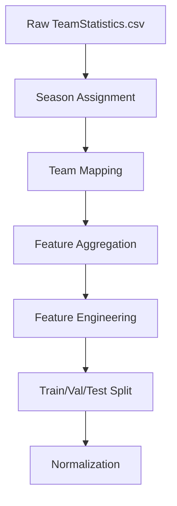

## Data processing pipeline

The data preparation pipeline transforms raw game-by-game statistics into team season aggregates suitable for playoff prediction. The process follows these steps:



## Season assignment

Since NBA seasons span two calendar years, games are assigned to seasons based on the month:

```python
df['season'] = df.apply(
    lambda x: x['year'] if x['month'] >= 10 else x['year'] - 1,
    axis=1
)
```

- Games from **October-December** → Current year's season
- Games from **January-June** → Previous year's season

This ensures all 82 regular season games are grouped correctly.

## Team franchise mapping

Teams that relocated or changed names are mapped to their current franchise identity using the TeamHistories.csv file:

<Accordion title="Example: Seattle SuperSonics → Oklahoma City Thunder">
  The Seattle SuperSonics (active 1967-2007) and Oklahoma City Thunder (2008-present) share the same `teamId` (1610612760). All historical Sonics data is mapped to the Thunder franchise for consistency.
</Accordion>

This mapping ensures historical continuity when teams relocate.

## Feature aggregation

Game-level statistics are aggregated to season-level using multiple methods:

### Mean statistics
Most features are averaged across all games in a season:

```python
agg_dict = {
    'fieldGoalsMade': 'mean',
    'threePointersMade': 'mean',
    'assists': 'mean',
    'reboundsTotal': 'mean',
    # ... etc
}
```

### Win percentage
Calculated as total wins divided by total games:

```python
win_pct = total_wins / total_games
```

### Opponent statistics
Defensive metrics are computed by averaging opponent performance:

```python
avg_points_allowed = df['opponentScore'].mean()
defensive_strength = -avg_points_allowed  # Negative for consistency
```

## Engineered features

Beyond simple aggregations, several advanced features are calculated:

<CardGroup cols={2}>
  <Card title="Point differential" icon="arrow-trend-up">
    Average margin of victory/defeat per game:
    ```python
    point_diff = avg_points_scored - avg_points_allowed
    ```
  </Card>
  
  <Card title="Effective FG%" icon="basketball">
    Adjusts field goal percentage for three-point value:
    ```python
    efg_pct = (fg_made + 0.5 * three_pt_made) / fg_attempted
    ```
  </Card>
  
  <Card title="Offensive strength" icon="bullseye">
    Composite of points scored and field goals made
  </Card>
  
  <Card title="Defensive strength" icon="shield">
    Inverse of average points allowed (negative scale)
  </Card>
</CardGroup>

## Final feature set

After aggregation and engineering, each team-season is represented by **27 features**:

### Core statistics (mean per game)
- `fieldGoalsMade_mean`, `fieldGoalsAttempted_mean`, `fieldGoalsPercentage_mean`
- `threePointersMade_mean`, `threePointersAttempted_mean`, `threePointersPercentage_mean`
- `freeThrowsMade_mean`, `freeThrowsAttempted_mean`, `freeThrowsPercentage_mean`
- `assists_mean`, `blocks_mean`, `steals_mean`, `turnovers_mean`
- `reboundsDefensive_mean`, `reboundsOffensive_mean`, `reboundsTotal_mean`
- `foulsPersonal_mean`, `plusMinusPoints_mean`

### Offensive/defensive metrics
- `avg_points_scored`, `avg_points_allowed`
- `offensive_strength`, `defensive_strength`

### Advanced metrics
- `win_pct` (win percentage)
- `point_diff` (average point differential)
- `efg_pct` (effective field goal percentage)

<Accordion title="Excluded features">
  Some features with high missing data were excluded:
  - `pointsInThePaint_mean`
  - `pointsFastBreak_mean`
  - `pointsFromTurnovers_mean`
  - `benchPoints_mean`
</Accordion>

## Target variable

The prediction target is binary:

```python
made_playoffs = 1  # Team made playoffs
made_playoffs = 0  # Team missed playoffs
```

Playoff qualification is determined by finishing in the **top 8** of either the Eastern or Western Conference.

## Train/validation/test split

The dataset is split chronologically to prevent data leakage:

<Steps>
  <Step title="Training set (70%)">
    Seasons 2000-2019 (20 seasons)
    - 446 team-seasons
    - Used for model training
  </Step>
  
  <Step title="Validation set (15%)">
    Seasons 2020-2021 (2 seasons)
    - 60 team-seasons  
    - Used for hyperparameter tuning
  </Step>
  
  <Step title="Test set (15%)">
    Seasons 2022-2023 (2 seasons)
    - 60 team-seasons
    - Used for final evaluation
  </Step>
</Steps>

<Note>
  A chronological split prevents the model from "seeing the future" during training, which would happen with random splitting of time series data.
</Note>

## Data normalization

Features are standardized using `StandardScaler` to have zero mean and unit variance:

```python
from sklearn.preprocessing import StandardScaler

scaler = StandardScaler()
X_train_scaled = scaler.fit_transform(X_train)
X_val_scaled = scaler.transform(X_val)
X_test_scaled = scaler.transform(X_test)
```

Normalization is critical because:
- Features have different scales (e.g., `assists_mean` ≈ 20-30, `win_pct` ≈ 0-1)
- Many ML algorithms (SVM, neural networks) are sensitive to feature scale
- Improves model convergence and performance

## Class balance

The training set has a near-even class distribution:

- **240 playoff teams** (53.8%)
- **206 non-playoff teams** (46.2%)

This balanced distribution means no special handling (e.g., SMOTE, class weights) is needed.

## Output files

The processed data is saved to `data/processed/`:

```
data/processed/
├── X_train_scaled.npy      # Normalized training features
├── X_val_scaled.npy        # Normalized validation features
├── X_test_scaled.npy       # Normalized test features
├── y_train.npy             # Training labels
├── y_val.npy               # Validation labels
├── y_test.npy              # Test labels
├── feature_names.json      # List of feature names
└── scaler.pkl              # Fitted StandardScaler object
```

## Next steps

<CardGroup cols={2}>
  <Card title="Exploratory analysis" icon="chart-mixed" href="/data/exploratory-analysis">
    Visualize feature distributions, correlations, and PCA
  </Card>
  
  <Card title="Model training" icon="brain" href="/models/overview">
    Learn how models are trained on this processed data
  </Card>
</CardGroup>